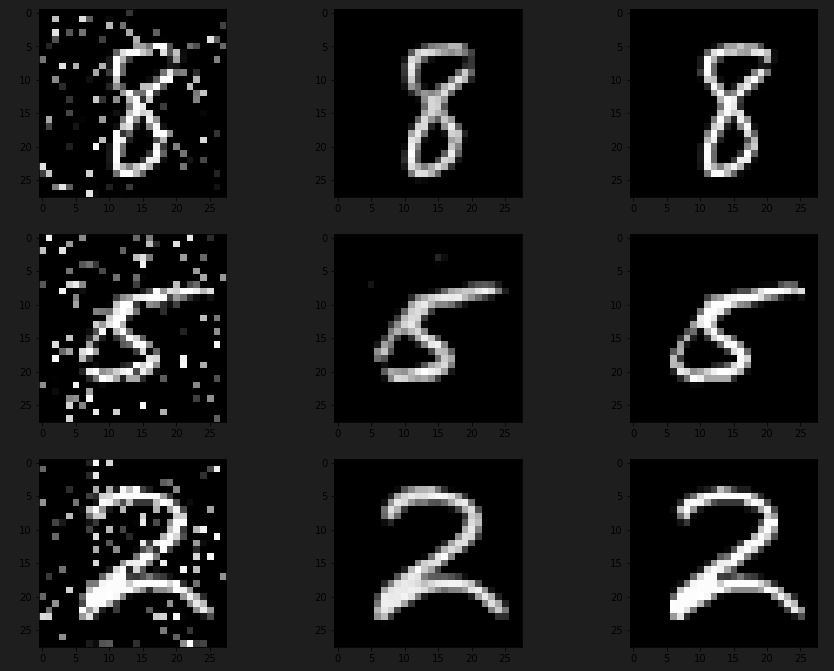

# CNN img2img - Image-Restoration & custom corrupted MNIST dataset

A Python project to implement an image restoration of a random corrupted MNIST dataset.

## Setup
* Download [MNIST dataset](https://www.kaggle.com/competitions/digit-recognizer/data) and put it in the current directory.
* `pip install -r requirements.txt`
* `jupyter notebook`
