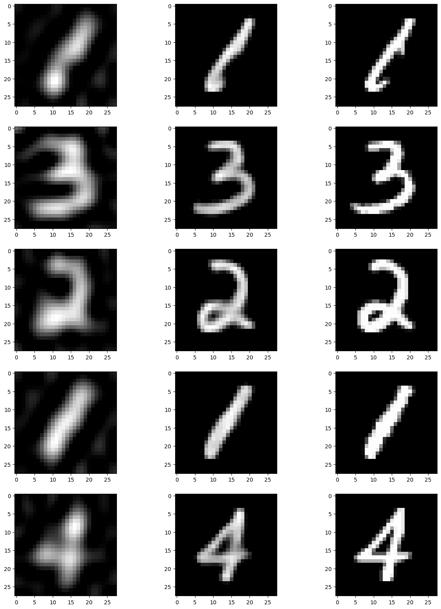

A Python project to implement an image restoration of a random corrupted MNIST dataset.

# 1. CNN pyotrch Image-Restoration & DCT & JPEG-like MNIST
In the following picture, the first column is composed of the noisy images using [DCT & JPEG-like](https://github.com/crisbal/dct-jpeg), the centre with the pictures as model output, and the last column with the real images.

# 0. CNN (CUDA) - Image-Restoration & custom MNIST dataset

In the following picture, the first column is composed of the random noisy images, the centre with the pictures as model output, and the last column with the actual images.

## Setup
* `git clone https://github.com/okamiRvS/CNN-Image-Restoration-custom-MNIST-dataset.git`
* `pip install -r requirements.txt`
* Download [MNIST dataset](https://www.kaggle.com/competitions/digit-recognizer/data) and put it in the current directory.
